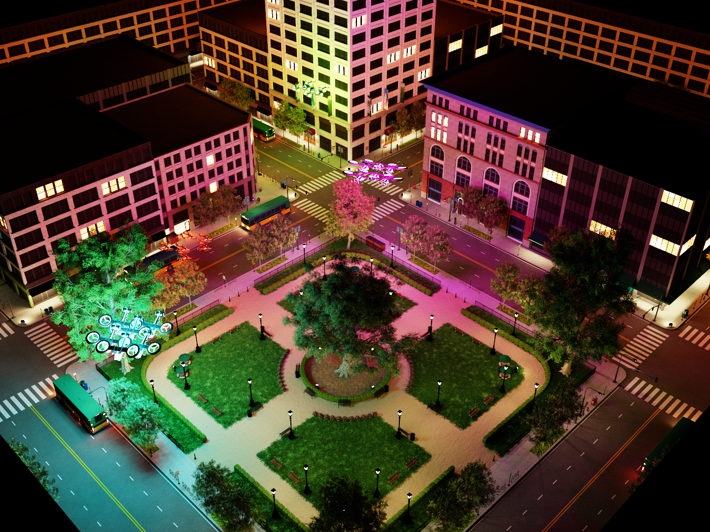
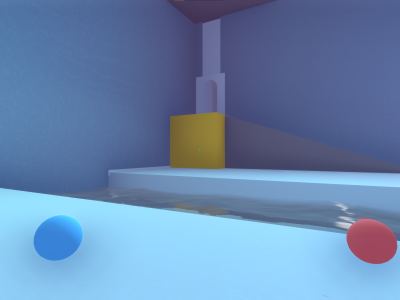
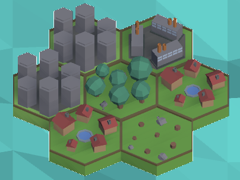
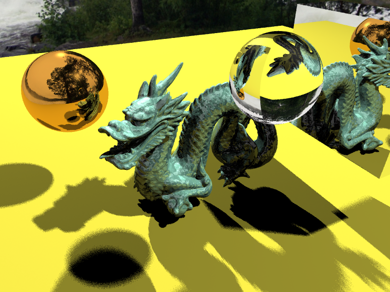
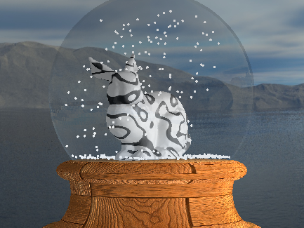

# Pedro Freire 
**`Software and Game Developer`**

I am passionate about problem solving and graphics/engine algorithms.
- Recently graduated with a Master's Degree in Computer Science, with a final grade of **18/20** on my thesis.
- I have enjoyed my experience with game development be it subjects projects or in gamejams.
- Currently working on medical imaging research to segment the colon and achieve high quality VR colonography with geometry based and CNN based methods

### Languages and Tools
C/C++, C#  
Python   
Slang(GPU)       
Unity

---

 

<h1>Projects</h3>

Some of my prefered projects from games to graphics programing in my thesis
  

  
  
  
  <h3><a href="https://github.com/PedroSFreire/FalcorLightBVH" >Two-Level Light BVH in Nvidea's Falcor</a></h3>
  <b>c++</b>
  
My theses where i implemented a Two-Level Light BVH to accelarate raytracing. Using Nvidea's Falcor engine as a base to upgrade.

  
  

  
  
  
  <h3><a href="https://github.com/PedroSFreire/Push-The-Pull" >PushPull</a></h3>
  <b>Unity, C#</b>
  
Developed for a gamejam. Manipulate objects and yourself by pulling and pushing on objects and figure out every Puzzle room.

 

  
  
  
  <h3><a href="https://github.com/PedroSFreire/Consequence-GamesForGoodJam" >Consequence</a></h3>
  <b>Unity, C#</b>
  
Developed for a  gamejam. Buy and upgrade tiles to improve your revenue. You have 10 years to reach your goal.

  

  
  
  
  <h3><a href="https://github.com/FranciscoMSousa/P3D" >CPU Raytracer</a></h3>
  <b> C++</b>
  
A cpu only Whitted raytracer using OpenGL, developed for a subject.

  

  
  
  
  <h3><a href="https://github.com/FranciscoMSousa/P3D" >SnowGlobe Engine</a></h3>
  <b> C++</b>
  
The SnowGlobe engine was made for a college subject. It uses openGl and was developed in c++.

  

