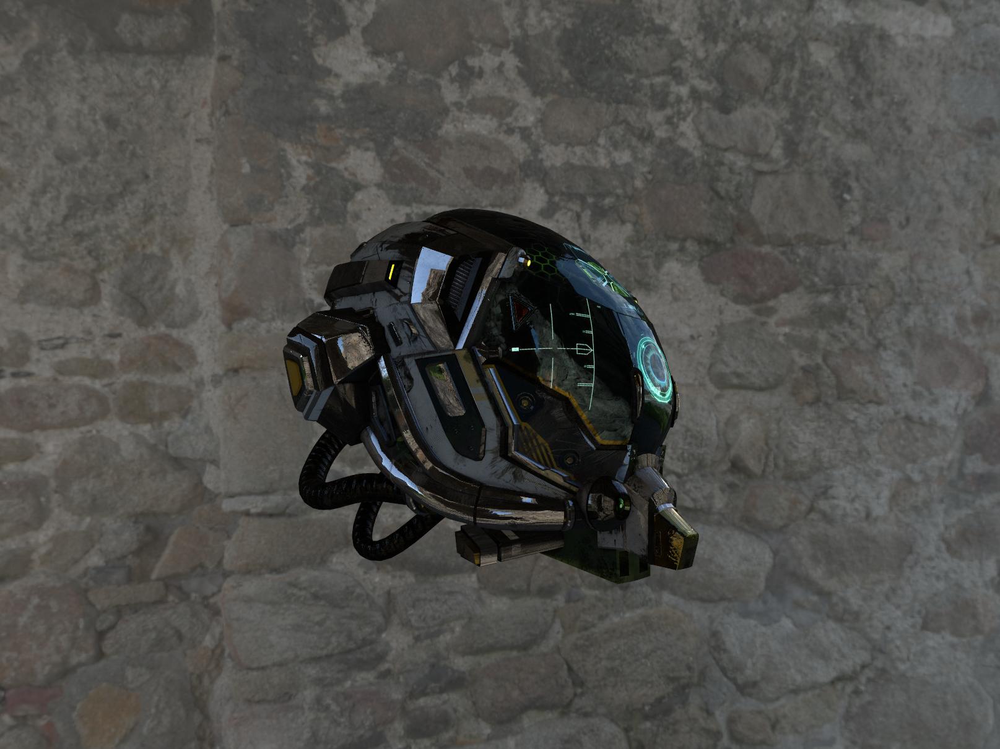
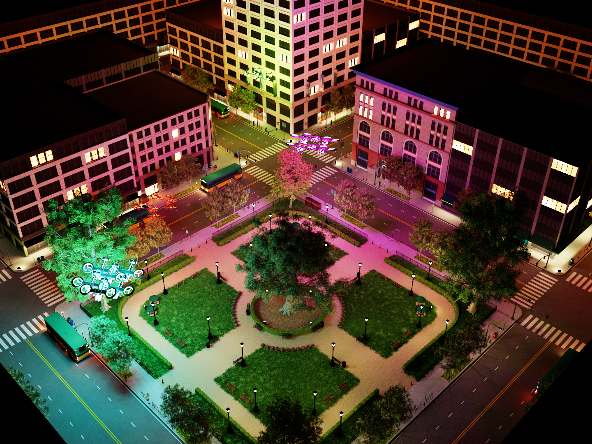
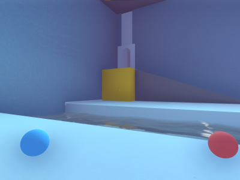
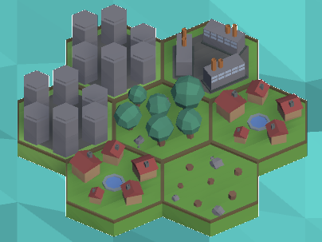
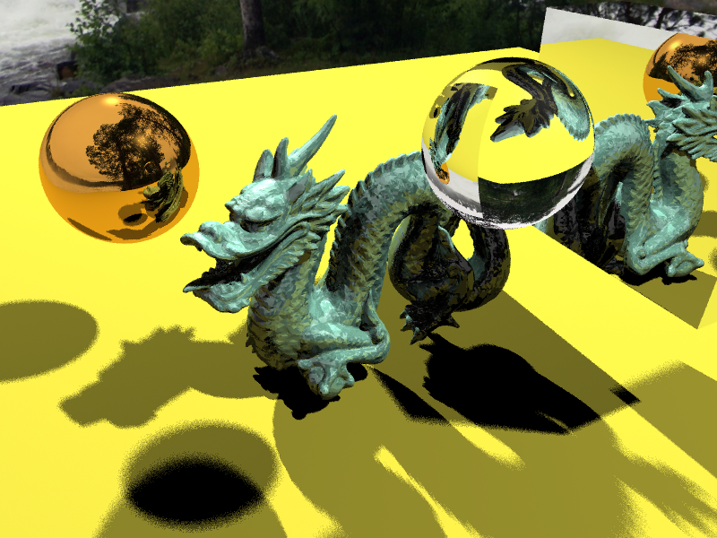
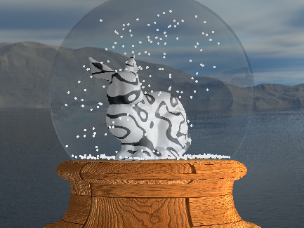

# Pedro Freire 

Hi, I'm Pedro a C++ developer interested in real-time rendering, graphics programming, and engine development.

## 🚧 Current Project

### VkEngine – Vulkan Rendering Engine

I am currently developing a real-time rendering engine in modern C++ using the Vulkan graphics API.

Features implemented so far:

- Forward physically based rendering (PBR)
- Image-based lighting (IBL)
- glTF 2.0 asset loading
- Scene graph system
- GPU resource manager
- RAII Vulkan object wrappers
- Environment map preprocessing
- Dear ImGui debugging interface

The goal of this project is to explore modern real-time rendering techniques and gain experience with low-level GPU programming and engine architecture.

  
  
  
  <h3><a href="https://github.com/PedroSFreire/VkEngine" >VkEngine</a></h3>
  <b>c++</b>
  
My real-time rendering engine in modern C++ using the Vulkan graphics API.

 

  

## 🎓 Master's Thesis

**Dynamic Many-Light Importance Sampling for Real-Time Ray Tracing**

My master's thesis focused on improving many-light sampling for real-time ray tracing in NVIDIA's Falcor rendering framework.

Main contributions:

- Implemented a two-level Bounding Volume Hierarchy (BVH) for light sampling
- Integrated the technique into Falcor
- Used GPU programming and asynchronous techniques to achieve real-time performance

This work resulted in a publication at IEEE VR Workshops.

Paper: (https://dspace.zcu.cz/items/8f65433d-f8de-4201-aecb-43a7a3a1a4fd)

  
  
  
  <h3><a href="https://github.com/PedroSFreire/FalcorLightBVH" >Two-Level Light BVH in Nvidea's Falcor</a></h3>
  <b>c++</b>
  
My thesis, where i implemented a Two-Level Light BVH to accelarate raytracing. Using Nvidea's Falcor engine as a base to upgrade.

 
  

  

### Languages and Tools
## 
C++,
Slang,GLSL      
Python,   
C#, 
RenderDoc, 
Unity

---

  

  

<h1>Projects</h3>
 

  
  
  
  <h3><a href="https://github.com/PedroSFreire/Push-The-Pull" >PushPull</a></h3>
  <b>Unity, C#</b>
  
Developed for a gamejam. Manipulate objects and yourself by pulling and pushing on objects and figure out every Puzzle room.

 
 

  
  
  
  <h3><a href="https://github.com/PedroSFreire/Consequence-GamesForGoodJam" >Consequence</a></h3>
  <b>Unity, C#</b>
  
Developed for a  gamejam. Buy and upgrade tiles to improve your revenue. You have 10 years to reach your goal.

 
 

  
  
  
  <h3><a href="https://github.com/FranciscoMSousa/P3D" >CPU Raytracer</a></h3>
  <b> C++</b>
  
A cpu only Whitted raytracer using OpenGL, developed for a subject.

  
 

  
  
  
  <h3><a href="https://github.com/FranciscoMSousa/P3D" >SnowGlobe Engine</a></h3>
  <b> C++</b>
  
The SnowGlobe engine was made for a college subject. It uses openGl and was developed in c++.

  

